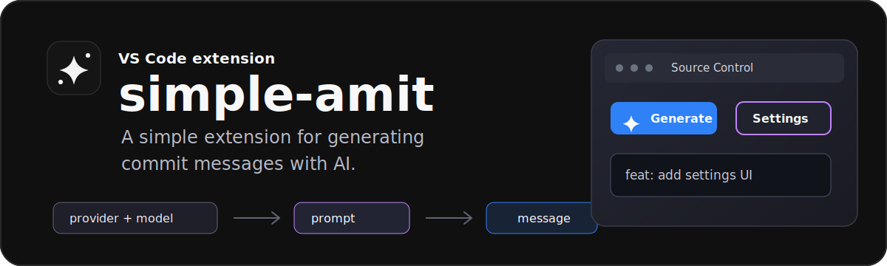
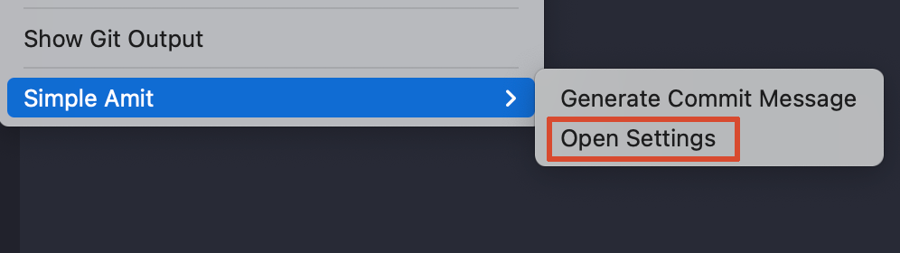
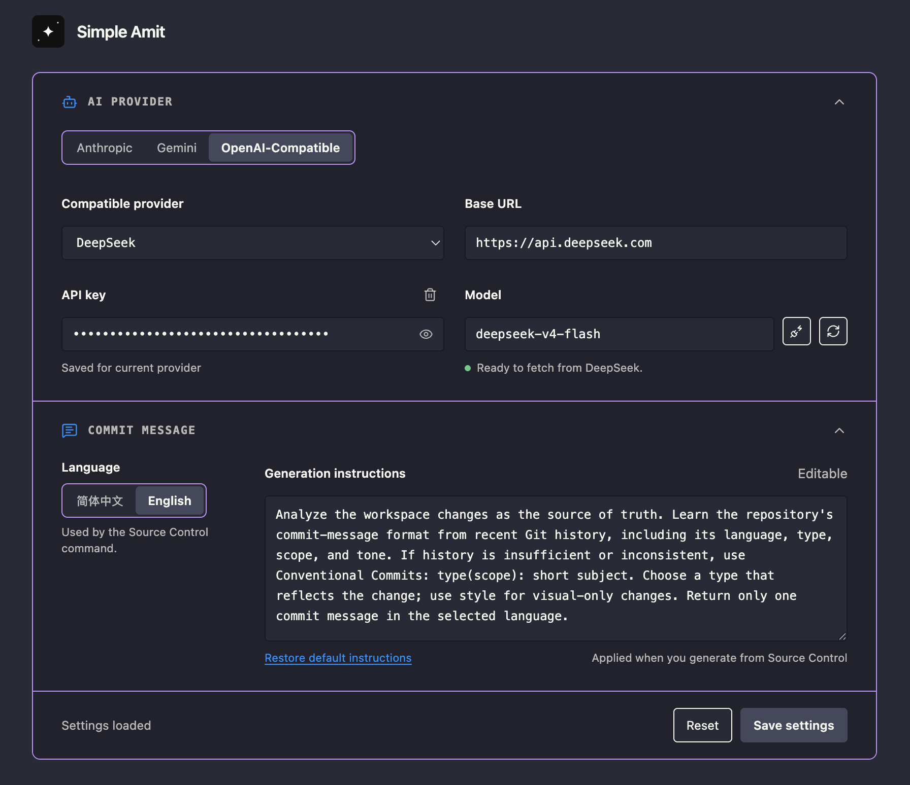
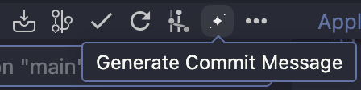

# simple-amit

  

A **simple** extension for generating **commit** message with **AI**.

## Quick Start

1. Search `simple-amit` in the VS Code Extension Marketplace and install it.
2. Open Source Control, choose `Simple Amit` -> `Open Settings`, then save your provider, model, API key, language, and prompt.

  

  

3. Click `Generate Commit Message` from Source Control.

  

